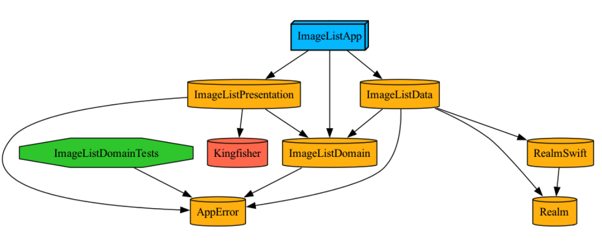

# ImageListApp

## Overview
An iOS app that fetches and displays a list of images from a remote API.  
This take-home project demonstrates a modular architecture, Swift Concurrency with async/await, and clean separation of concerns using MVVM.

## Features
- Display image list from API
- Async fetch using Swift Concurrency
- Error handling with user-friendly alerts and retry options
- Modular Clean Architecture (Data/Domain/Presentation)
- Persist image data locally using Realm database

## Tech Stack
- Swift, SwiftUI, Swift Concurrency, Swift Package Manager, Swift Testing
- Tuist, Kingfisher, Realm

## Getting Started

### Requires
- Xcode 16.0+
- Tuist 4.55.6
    
### Installation Instructions

1. Install [mise](https://mise.jdx.dev/getting-started.html)
    
    ```
    curl https://mise.run | sh
    ```
    
2. Add the following to your shell configuration:
    ```
    # bash
    echo 'eval "$(~/.local/bin/mise activate bash)"' >> ~/.bashrc

    # zsh
    echo 'eval "$(~/.local/bin/mise activate zsh)"' >> ~/.zshrc

    # fish
    echo '~/.local/bin/mise activate fish | source' >> ~/.config/fish/config.fish
    ```

3. Install [tuist](https://docs.tuist.dev/en/guides/quick-start/install-tuist)
    
    ```
    mise install tuist@4.55.6
    ```
    
4. Run the following commands in the project directory:
    
    ```
    mise trust
    mise use tuist@4.55.6
    ```
    
5. Install dependencies
_(Note: Initial fetching of packages may take some time)_
    ```
    tuist install
    ```
6. Generate the workspace
_(Once dependencies are fetched, this command will generate the full project)_
    
    ```
    tuist generate
    ```

## Project Structure
### Folder Structure
```
ImageListApp
├── ImageListApp
├── Frameworks
│   ├── ImageList
│   │   ├── ImageListData
│   │   ├── ImageListDomain
│   │   └── ImageListPresentation
│   └── AppError
└── Dependencies
    └── Kingfisher
    └── Realm
```

### Dependencies Structure



This diagram shows how the app is organized into modular layers: Data, Domain, and Presentation, following clean architecture principles.

## App Demo

